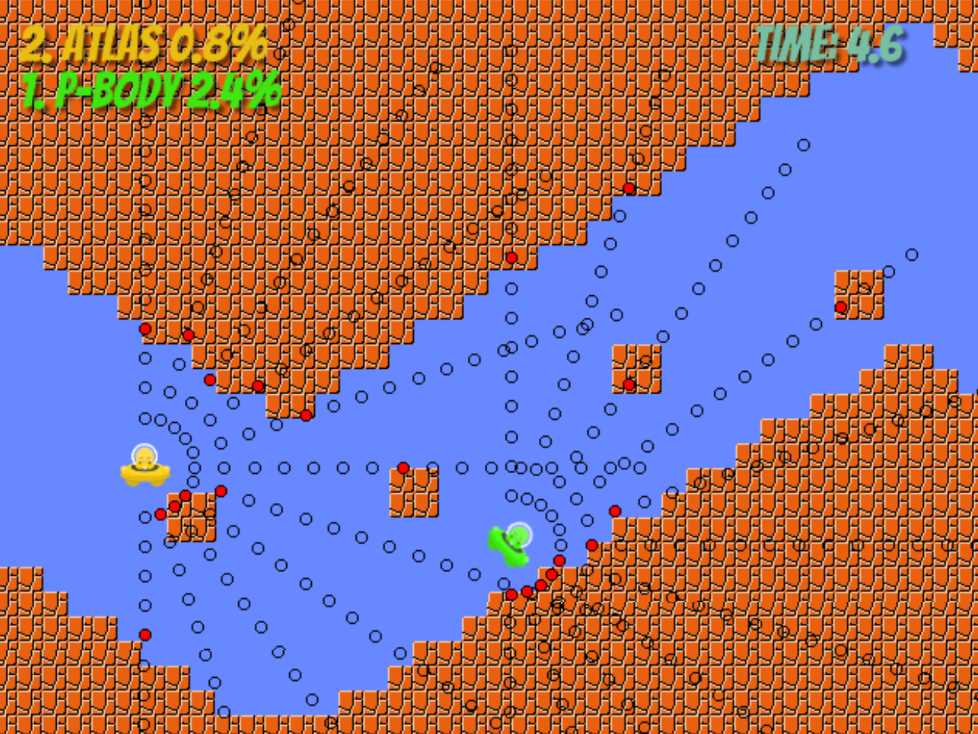
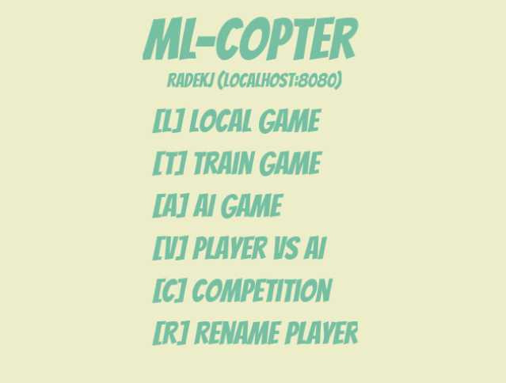

MLCopter
========

A helicopter-like game prepared as an example for starting an adventure with
with Machine Learning process.
The purpose of the game is to use an ML algorithm to train a self-steering
vehicle model.

# Table of Contents

- [Installation](#installation)
- [Running the game](#running-the-game)
- [Teaching the algorithm](#teaching-the-algorithm)
- [Competition prerequisites](#competition-prerequisites)

# Installation

### Initial requirements

#### Running on local instance:

* [Python 3.6](https://www.python.org/downloads/release/python-364/)
* [mogodb](https://docs.mongodb.com/getting-started/shell/installation/) or `make docker_mongo`

#### Running in docker environment:

* [Docker](https://docs.docker.com/install/)
* [docker-compose](https://docs.mongodb.com/getting-started/shell/installation/)

### Local installation

1. Clone the repository:

        git clone git@github.com:stxnext/ml-copter-player.git
        cd ./ml-copter-player

1. Create python virtual environment (assuming python interpreter accessible with alias `python3.6`):

        make venv

    *Sidenote: If you have installed Python 3.6 via Ubuntu package manager, then you might need to install `python3.6-venv` package firstly:*

        sudo apt-get install python3.6-venv

1. Install required packages:

        make install

### Installation in docker environment

1. Run command:

        make docker_build

### Mongodb connection configuration

Mongodb connection settings are placed in file `settings.py`.
By default the mongodb server is expected to be running at its default host and port (`localhost:27017`).

# Running the game

To start the game run command:

    make run

or when running in docker:

    make docker_up

and in the browser open the address:

    http://localhost:8080

You should be able to see a menu page where you can choose one of followin game modes:

1. `Local game` - try out the game without collecting any data
1. `Train game` - the data from the sensors will be stored in the db
1. `AI game` - run the game where the vehicle is controlled by the AI model
1. `Player vs AI` - run the game where a player is competing against the AI model

The game map is generated randomly, but you should be able to control some of the
parameters of the map by adding parameters in the url:

    http://localhost:8080/?seed=123123&length=120

where the parameters meaning is:

* `seed` - the initial seed of the map generator
* `length` - the length of the map

# Teaching the algorithm

The objective of the game is to train the model to be able to control the
vehicle and acomplish the map in the shortest time, which means it should
avoid hitting the obstacles.

### Data stored in the database

While running the game in `Train` mode the data from sensors is stored
in the db, where an example entry format is:

    {
        "_id" : ObjectId("5a9427446656911cf10888b9"),
        "meta" : {
            "gameId" : "7b37a4e0-1b09-11e8-99c3-a33cefb963b3",
            "playerName" : "RadekJ"
        },
        "data" : {
            "yV" : 36.2666666666667,
            "hV" : 0.4,
            "u" : false,
            "l" : false,
            "r" : true,
            "s" : [
                3,
                3,
                2,
                3,
                3,
                5,
                10,
                null,
                9,
                4,
                3
            ],
            "ts" : 0.282,
            "x" : 32.0022222222222
        }
    }

Where:

* The `meta` object contains some additional parameters that may be used for filtering the data
to be used for training.

* The `data` object contains parameters describing the state of the vehicle
in given moment:

    * `ts` - time measured from the beginning of given game
    * `x`  - horizontal position on the map (increasing when moving right direction)
    * `yV` - vertical velocity (negative value when moving up)
    * `hV` - horizontal velocity (negative value when moving left direction)
    * `u`  - boolean information if `up` key was pressed
    * `l`  - boolean information if `left` key was pressed
    * `r`  - boolean information if `right` key was pressed
    * `s`  - sensors data: each item of the list represents one of 10 distance sensors, as presented at image below.
        Integer value of each sensor represents the dinstance from the terrain or an obstacle.
        For example, the value of `0` means that the closest point of the sensor is touching the terrain, value `4` means that the fifth closest point is touching the terrain and so on.
        The `null` value means that none of the points of given sensor is touching the terrain.

    

### Cleaning up the database

You can clean up the database by running a script:

    make clean_db

#### Important!!

Running this command will permanently delete all the entries you have collected during your
training flights. For more advanced database operations you should consider using
[mongo db shell](https://docs.mongodb.com/getting-started/shell/client/) or [MongoDB GUI tool](https://robomongo.org/)

### Teaching flow

Assuming you have some data collected in the database, you should be able to use it for
training the AI algorithm that will be responsible for controlling the vehicle.

The `teach.py` module already contains some initial code that will let you avoid wasting time for writting boilerplate code.

The objective is to write the `train_and_save` function so it will train a chosen ML algorithm
with the training data collected during training flights and store the trained model.

The common flow assume the following steps:

* get data
* store data
* load and analyze data
* transform data
* teach the algorithm
* predict
* assess

(For more details see the blog post: https://stxnext.com/blog/2017/12/12/getting-started-machine-learning-python/)

However, some of these steps are already accomplished, so you can focus on data pre-processing and choosing and tuning the algorithm.

To gain necessary knowledge about ML algorithms, it's advised to familiarize yourself with [scikit-learn docummentation](scikit-learn.org/stable/supervised_learning.html)

### Running the teaching script

You can simply run the teaching script with a command:

    make teach

or when running in docker:

    make docker_teach

### Teaching script output

As the result of running the teaching script you should receive a saved object of
the trained model (e.g. stored as a pickle) which would be then available for
making predictions of which keys should be pressed in given situation.

### Making predictions

The `websocket_handler` function (defined in `controllers.py` module)
which is responsible for communication with the browser,
should respond with prediction of keys to be pressed for given input
conditions (in json format).

For example the browser would send:

    {
        "yV":23.466666666666637,
        "hV":129.59999999999957,
        "s":[3, 4, 3, 4, 7, null, null, 1, 1, 4, 6],
        "ts":2.169,
        "x":224.91111111111104
    }

this data is passed to the `predict` method (defined in `teach.py` module),
which is expected to use the trained model to predict the answer in the form of
iterable of 3 boolean-castable values (up, left, right), e.g:

    [True, False, True]

so the server would respond with json:

    {
        "u": true,
        "l": false,
        "r": true
    }

# Competition prerequisites

To take part in the competition, the player is expected to deliver a host address where
a running server handles websocket communication on `/predict` endpoint.
It's also important that the player's server have to be accessible for the competition server
(must be in the same network).
